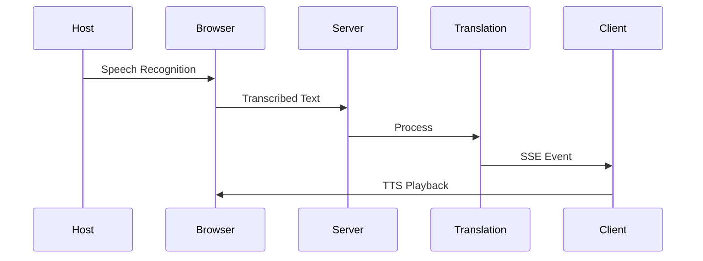
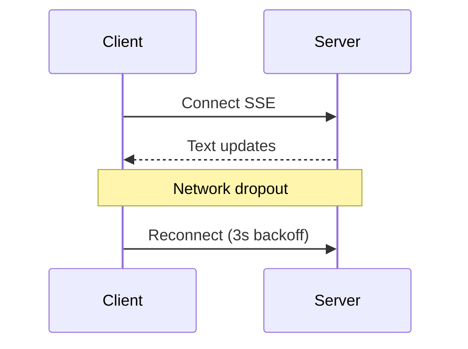
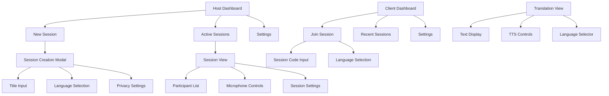

# Software Requirements Specification (SRS) v3.0  
*Last Updated: DD/MM/YYYY*  

---

## **1. Introduction**  
### **1.1 Purpose**  
This document defines requirements for a real-time sermon translation system using browser-based technologies and server-sent events (SSE) for text transmission.

### **1.2 Assumptions**  
- Supported languages: English, Ukrainian, German  
- Core technologies: Web Speech API (STT), Browser TTS, SSE (text)  
- Roles: Host (preacher), Client (listener)  
- Browser requirements: Modern browser with Web Speech API support  

---

## **2. User Management Requirements**  
### **UM.1 User Registration**  
**Requirement**: Users shall sign up via email/password or OAuth (Google, Facebook).  
**Rationale**: Secure access control with multiple auth options.  

### **UM.2 Role Assignment**  
**Requirement**:  
- Hosts: Can create/manage sessions.  
- Clients: Can join sessions and receive translations.  
**Validation**: Role visible in user profile dashboard.  

---

## **3. Session Management Requirements**  
### **SM.1 Session Creation**  
**Requirement**: Hosts shall create sessions via a "New Session" button with:  
- Title  
- Default language (English/Ukrainian/German)  
- Privacy setting (Public/Invite-only)  

### **SM.2 Microphone Access**  
**Requirement**: Browser mic permissions must be granted before speech recognition.  
**Error Case**: Show "Microphone Required" modal if denied.  

### **SM.3 Participant Monitoring**  
**Requirement**: Real-time list of connected clients with:  
- User ID  
- Selected language  
- Connection status (stable/unstable)  

---

## **4. Real-Time Communication Requirements**  
### **RC.1 Speech Recognition**  
**Requirement**:  
- Use Web Speech API for STT  
- Support continuous recognition  
- Handle interim results  
- Language detection and switching  

### **RC.2 Text Transmission**  
**Requirement**: SSE events shall include:  
```json
{
  "text": "Transcribed content", 
  "lang": "en",
  "timestamp": 1672531200,
  "is_final": false,
  "confidence": 0.95
}
```

---

## **5. Translation Requirements**  
### **TR.1 Language Selection**  
**Requirement**: Clients shall switch languages mid-session with <1s delay.  

### **TR.2 Text Translation**  
**Requirement**:  
- Use e.g LibreTranslate for server-side translation  
- Cache frequent translations  
- Support fallback to browser-based translation if needed  

### **TR.3 Text-to-Speech**  
**Requirement**:  
- Use browser's built-in TTS  
- Support rate adjustment (120–200 words/minute)  
- Handle multiple languages  

---

## **6. Performance Requirements**  
### **PR.1 Latency**  
**Requirement**: End-to-end pipeline ≤2s (speech-to-translation).  

### **PR.2 Scalability**  
**Requirement**:  
- Support 1,000 concurrent clients/session  
- Minimal server resource usage  
- Efficient browser resource management  

### **PR.3 Accuracy**  
**Requirement**:  
- Translation: ≥90% BLEU score  
- Speech recognition: Use highest quality browser STT available  

---

## **7. Security Requirements**  
### **SP.1 Encryption**  
**Requirement**: TLS 1.3 for all data in transit.  

### **SP.2 Data Retention**  
**Requirement**: No persistent storage of audio or transcripts.  

### **SP.3 Access Control**  
**Requirement**: Invite-only sessions require approval.  

---

## **8. API Specifications**  
### **8.1 SSE Translation API**  
```plaintext
GET /sse/translate
Streams: text/event-stream
Example Event:
event: update
data: {"text": "Hello", "lang": "en", "is_final": false}
```

---

## **9. Sequence Diagrams**  
### **9.1 Browser-Based Flow**  


### **9.2 Reconnection Flow**  


---

## **10. Compliance**  
### **10.1 GDPR**  
- Right to delete account + all data  
- Minimal data collection and storage  

### **10.2 WCAG 2.1**  
- Keyboard navigable interface  
- Screen reader support for transcripts  
- Adjustable text size and contrast  

---

## **11. User Interface Requirements**

### **UI.1 Technology Stack**
**Requirement**: The application shall use:
- React for component-based development
- Tailwind CSS for styling
- DaisyUI for component library
- React Router for navigation
- React Query for data fetching
- Zustand for state management

### **UI.2 Host Interface**

#### **UI.2.1 Session Management**
**Requirement**: Host interface shall include:
- "New Session" button with modal for:
  - Session title input
  - Default language selection
  - Privacy settings (Public/Invite-only)
  - Session duration setting
- Session status indicator (Active/Ended)
- "End Session" button with confirmation
- Automatic session end on tab/window close
- Participants list in real time joining/leaving

#### **UI.2.2 Microphone Control**
**Requirement**: Microphone interface shall provide:
- Microphone status indicator (On/Off/Muted)
- Permission request modal if not granted
- Visual feedback for speech detection
- Audio level meter
- Mute toggle button

#### **UI.2.3 Participant Management**
**Requirement**: Participant panel shall display:
- Real-time list of connected clients
- Client language preferences
- Connection status indicators
- Client count
- Option to remove participants (if needed)

#### **UI.2.4 Session Settings**
**Requirement**: Settings panel shall include:
- Available translation languages
- Default language selection
- Speech recognition language
- TTS voice selection
- Session timeout settings

### **UI.3 Client Interface**

#### **UI.3.1 Session Joining**
**Requirement**: Join interface shall provide:
- Session code/URL input
- Language preference selection
- Connection status indicator
- "Join Session" button
- Error handling for invalid sessions

#### **UI.3.2 Translation View**
**Requirement**: Translation interface shall include:
- Current translation text display
- Language selector dropdown
- TTS controls (Play/Pause/Rate)
- Text size adjustment
- Dark/Light mode toggle

#### **UI.3.3 Session Information**
**Requirement**: Info panel shall show:
- Session title
- Host name
- Current language
- Connection quality
- Time remaining (if set)

### **UI.4 Dashboard**

#### **UI.4.1 Host Dashboard**
**Requirement**: Host dashboard shall display:
- Active sessions list
- Past sessions history
- Session statistics
- Quick start new session button
- Profile settings

#### **UI.4.2 Client Dashboard**
**Requirement**: Client dashboard shall show:
- Recent sessions
- Favorite languages
- Connection history
- Account settings
- Help/Support section

### **UI.5 Common Components**

#### **UI.5.1 Navigation**
**Requirement**: Navigation shall include:
- Responsive sidebar/menu
- Breadcrumb navigation
- Quick access buttons
- User profile menu
- Language selector

#### **UI.5.2 Notifications**
**Requirement**: Notification system shall provide:
- Connection status alerts
- Session updates
- Error messages
- Permission requests
- System messages

#### **UI.5.3 Accessibility**
**Requirement**: Interface shall support:
- Keyboard navigation
- Screen reader compatibility
- High contrast mode
- Adjustable text sizes
- ARIA labels

### **UI.6 Responsive Design**
**Requirement**: Interface shall be responsive with:
- Mobile-first approach
- Breakpoints for:
  - Mobile (< 640px)
  - Tablet (640px - 1024px)
  - Desktop (> 1024px)
- Adaptive layouts
- Touch-friendly controls

### **UI.7 Error Handling**
**Requirement**: Error states shall include:
- Connection loss recovery
- Microphone permission errors
- Session join failures
- Translation errors
- Network issues

### **UI.8 Loading States**
**Requirement**: Loading indicators shall show for:
- Session initialization
- Translation processing
- Connection establishment
- Data fetching
- Language switching

## **12. UI Mockups**


## **Appendix**  
### **A.1 Glossary**  
- **Web Speech API**: Browser-native speech recognition and synthesis  
- **SSE**: HTTP-based server push for text  
- **TTS**: Text-to-Speech (browser-based)  

### **A.2 Revision History**  
- v3.0: Updated for browser-based solution, removed streaming requirements  
- v2.0: Complete SRS with all requirements + diagrams  
- v1.0: Initial draft  

---

### **Key Changes in v3.0**:  
1. **Removed Audio Streaming**: Focus on browser-based speech recognition  
2. **Simplified Architecture**: Removed audio storage and streaming requirements  
3. **Browser-Centric**: Emphasis on Web Speech API and browser capabilities  
4. **Resource Efficiency**: Minimized server requirements  

**Usage**:  
1. Save as `SRS_v3.md`  
2. Render with any Markdown viewer supporting Mermaid (e.g., GitHub, VS Code)

### **A.3 UI Component Library**
- **Buttons**: Primary, Secondary, Ghost, Link
- **Forms**: Input, Select, Checkbox, Radio
- **Cards**: Session, Participant, Stats
- **Modals**: Session Creation, Settings, Alerts
- **Navigation**: Sidebar, Topbar, Breadcrumbs
- **Indicators**: Loading, Status, Progress
- **Tables**: Participant List, Session History
- **Charts**: Usage Statistics, Performance Metrics

### **A.4 Color Scheme**
- Primary: #3B82F6 (Blue)
- Secondary: #10B981 (Green)
- Accent: #F59E0B (Amber)
- Background: #FFFFFF (Light) / #1F2937 (Dark)
- Text: #111827 (Dark) / #F9FAFB (Light)
- Error: #EF4444 (Red)
- Success: #10B981 (Green)
- Warning: #F59E0B (Amber)
- Info: #3B82F6 (Blue)